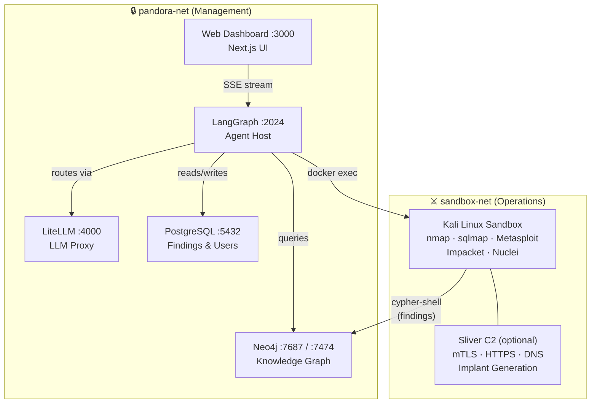

<p align="center">
  
</p>

<h1 align="center">Pandora — Autonomous AI Red Team Framework</h1>

<p align="center"><i>"Pandora opens what should stay closed."</i></p>

<p align="center">
<strong>Multi-agent autonomous red team platform for AI systems, web applications, Active Directory, cloud infrastructure, and smart contracts.</strong>
</p>

<p align="center">
  <a href="https://github.com/debasishtripathy13/Pandora/blob/main/LICENSE">
    
  </a>
  <a href="https://github.com/debasishtripathy13/Pandora/stargazers">
    
  </a>
</p>

---

## What is Pandora?

Pandora is an **autonomous AI-powered red team framework** that orchestrates a team of specialist AI agents across the full attack kill chain. It combines military-style operational planning (OPPLAN), a persistent knowledge graph, and an isolated Kali Linux sandbox to conduct end-to-end penetration testing engagements with minimal human intervention.

Built for security researchers and red teams, Pandora covers:

- **AI red teaming** — jailbreaking, prompt injection, encoding bypass, OWASP LLM Top 10 scanning
- **Traditional red teaming** — web exploitation, Active Directory attacks, cloud IAM escalation, binary reversing
- **Vulnerability research** — automated 5-stage CVE discovery, verification, and patch generation
- **Smart contract auditing** — Solidity/EVM reentrancy, oracle manipulation, flash loan attacks

Every engagement is tracked via a live OPPLAN document. Agents spawn fresh per objective, persist findings to a knowledge graph and disk, and hand off to the next specialist automatically.

---

## Architecture



**Security isolation**: The sandbox cannot reach LiteLLM, PostgreSQL, or LangGraph. Neo4j is intentionally dual-homed so agents write findings via the knowledge graph without crossing the management network.

---

## Quick Start

**Prerequisites:** Docker + Docker Compose v2, and at least one LLM provider API key.

```bash
# Clone
git clone https://github.com/debasishtripathy13/Pandora.git
cd Pandora

# Start all services
docker compose up -d

# First-time setup wizard
python -m pandora onboard

# Launch the CLI
python -m pandora
```

The onboard wizard guides you through configuring your LLM credentials and sets up `~/.pandora/.env`.

---

## Agents

Pandora runs **16 specialist agents** organized by kill chain phase.

### Orchestrators

| Agent | Role |
|-------|------|
| **Pandora** | Master red team orchestrator — reads OPPLAN, delegates to all specialist agents |
| **RedAgent** | AI-focused orchestrator — leads jailbreaking, scanning, and prompt engineering campaigns |
| **Vulnresearch** | Vulnerability research orchestrator — runs the 5-stage scanner pipeline end-to-end |
| **Soundwave** | Engagement planner — interviews the operator and generates RoE, ConOps, and OPPLAN |

### AI Red Team

| Agent | Role |
|-------|------|
| **Jailbreaker** | Applies DAN, AIM, ShadowChat templates and converter chains to bypass AI safety measures |
| **AIScanner** | Scans target models against OWASP LLM Top 10 and MITRE ATLAS attack scenarios |
| **PromptEngineer** | Constructs and optimizes encoding pipelines (base64 → unicode → emoji) for maximum bypass rate |

### Reconnaissance & Exploitation

| Agent | Role |
|-------|------|
| **Recon** | OSINT, subdomain enumeration, port scanning, service fingerprinting |
| **Exploit** | Initial access — SQLi, SSTI, Kerberoasting, ADCS, web application attacks |
| **Post-Exploit** | Privilege escalation, lateral movement, persistence, credential access |

### Domain Specialists

| Agent | Role |
|-------|------|
| **ADOperator** | Active Directory — Kerberoasting, DCSync, ADCS ESC1-15, PtH, Golden Ticket |
| **CloudHunter** | Cloud IAM escalation, S3 exposure, Kubernetes RBAC, metadata abuse (AWS/GCP/Azure) |
| **ContractAuditor** | Solidity/EVM smart contract auditing — reentrancy, oracle, flash loan attacks |
| **Reverser** | Binary analysis, ROP gadgets, packer detection (ELF/PE/Mach-O) |
| **Analyst** | Source code review, static analysis, CVE sweeps, exploit chain construction |

### Vulnerability Research Pipeline

A 5-stage automated pipeline orchestrated by **Vulnresearch**:

```
Scanner → Detector → Verifier → Exploiter → Patcher
```

| Stage | Output |
|-------|--------|
| Scanner | Vulnerability candidates with CVE/CVSS |
| Detector | Confidence-rated findings with detection rules |
| Verifier | Confirmed findings using 2+ independent methods |
| Exploiter | Working proof-of-concept code |
| Patcher | Patch code or configuration fix |

---

## Attack Techniques

### AI Red Team

- **Jailbreaking**: DAN, AIM, ShadowChat, authority impersonation, hypothetical framing
- **Prompt Injection**: Direct, indirect, XML injection, multi-turn exploits
- **Encoding Bypass**: Base64, ROT13, hex, ASCII smuggling, Unicode normalization, Unicode confusables, Zalgo text, emoji overload
- **Scoring**: Refusal detection, bypass rate measurement, content filter detection, quality degradation analysis

### Traditional Red Team

- **Web**: SQLi, SSTI, XSS, SSRF, LFI, OAuth flaws, JWT attacks
- **Active Directory**: Kerberoasting, AS-REP roasting, DCSync, Pass-the-Hash, ADCS ESC1-15, Golden/Silver Ticket
- **Cloud**: IAM privilege escalation, EC2 metadata, IMDS abuse, S3 bucket exposure, Kubernetes RBAC
- **Binary**: ROP chain construction, packer detection, shellcode analysis, format string exploits
- **Smart Contracts**: Reentrancy, oracle manipulation, flash loan attacks, access control flaws

---

## MITRE Coverage

### MITRE ATLAS (AI Threats)

| ID | Technique |
|----|-----------|
| TA0001 | Initial Access — prompt injection |
| TA0005 | Defense Evasion — encoding bypass |
| TA0007 | Discovery — model capability probing |
| TA0004 | Privilege Escalation — constraint bypass |
| TA0011 | Impact — model behavior modification |
| T1620 | Deobfuscate/Decode — encoding techniques |

### OWASP LLM Top 10

| ID | Vulnerability |
|----|--------------|
| LLM01 | Prompt Injection |
| LLM02 | Insecure Output Handling |
| LLM04 | Model Denial of Service |
| LLM06 | Sensitive Information Disclosure |
| LLM07 | Insecure Plugin Design |
| LLM08 | Excessive Agency |
| LLM09 | Misalignment |
| LLM10 | Model Theft |

---

## Supported LLM Providers

Pandora routes all LLM calls through a built-in LiteLLM proxy. Configure one or more providers — the framework builds a fallback chain automatically.

**API key providers:**

| Provider | Env Variable |
|----------|-------------|
| Anthropic | `ANTHROPIC_API_KEY` |
| OpenAI | `OPENAI_API_KEY` |
| Google Gemini | `GEMINI_API_KEY` |
| DeepSeek | `DEEPSEEK_API_KEY` |
| xAI | `XAI_API_KEY` |
| Mistral | `MISTRAL_API_KEY` |
| MiniMax | `MINIMAX_API_KEY` |
| OpenRouter | `OPENROUTER_API_KEY` |
| Nvidia NIM | `NVIDIA_API_KEY` |

**Subscription OAuth** (no per-token billing):
Claude Max/Pro/Team · ChatGPT Pro/Plus/Team · Gemini Advanced · Copilot Pro · xAI SuperGrok · Perplexity Pro

**Local / self-hosted:**
Ollama (`OLLAMA_API_BASE`) · any OpenAI-compatible gateway (`CUSTOM_OPENAI_API_BASE`)

**Model profiles:**

| Profile | Agent tier | Use case |
|---------|-----------|----------|
| `eco` | Per-agent tier (HIGH/MID/LOW) | Default — best cost/performance balance |
| `max` | All HIGH | High-value targets |
| `test` | All LOW | Development / CI |

---

## OPPLAN — Engagement Tracking

Every engagement is driven by an **OPPLAN** (Operations Plan) — a structured document containing objectives, phases, dependencies, and status. Agents read and update it in real time.

```
Soundwave interviews operator
        ↓
Generate: RoE → ConOps → Deconfliction Plan → OPPLAN
        ↓
Operator approves OPPLAN
        ↓
Pandora/RedAgent orchestrator starts
        ↓
Loop:
  pick next objective (dependencies met)
  → spawn specialist agent (fresh context)
  → execute in Kali sandbox
  → write findings to disk + knowledge graph
  → update OPPLAN status
        ↓
Final report generated
```

OPPLAN phases: `recon` · `initial-access` · `post-exploit` · `c2` · `exfiltration` · `ai-red-team`

OPSEC levels: `loud` · `standard` · `careful` · `quiet` · `silent`

---

## Knowledge Graph

All findings flow into a **Neo4j knowledge graph** shared between the sandbox and agents. This enables multi-hop attack chain planning across objectives.

**Node types:** Host · Service · Vulnerability · Credential · Account

**Relationships:** `EXPLOITS` · `REQUIRES` · `AFFECTS` · `LEADS_TO`

Agents query the graph to understand what's already been discovered and what attack paths are available. The sandbox writes findings directly via `cypher-shell`.

---

## Data Persistence

| Store | Contents |
|-------|----------|
| `/workspace/findings/` | Individual `FIND-NNN.md` files — YAML frontmatter + Markdown body |
| `/workspace/plan/opplan.json` | Live OPPLAN — objective status, dependencies, phase |
| `/workspace/.scratch/` | Large command outputs (>15K chars) |
| Neo4j | Attack graph — hosts, services, CVEs, credentials |
| PostgreSQL | Engagement index, user accounts, LLM usage/spend |

---

## Skills System

Pandora ships **21 skill libraries** covering every agent role. Skills use progressive disclosure to minimize token usage:

1. **YAML frontmatter** (~100 tokens) — loaded at agent boot
2. **Full SKILL.md body** (~2K tokens) — loaded on demand
3. **Reference documents** — deep-dive technique guides loaded explicitly

Skill categories: `ai_red_team` · `recon` · `exploit` · `post-exploit` · `ad` · `cloud` · `contracts` · `reversing` · `scanner/detector/verifier/exploiter/patcher` · `analyst` · `shared`

---

## Sliver C2 (Optional)

Enable the integrated Sliver C2 server for post-exploitation:

```bash
COMPOSE_PROFILES=c2-sliver docker compose up -d
```

Supports: mTLS · HTTPS · DNS-based C2 · Implant generation (Windows, Linux, macOS)

---

## Configuration

All configuration lives in `~/.pandora/.env` (created by `pandora onboard`).

Key variables:

| Variable | Default | Description |
|----------|---------|-------------|
| `PANDORA_MODEL_PROFILE` | `eco` | Model tier profile: `eco`, `max`, `test` |
| `PANDORA_PROVIDER_PRIORITY` | auto | Comma-separated provider order |
| `PANDORA_AUTH_CLAUDE_CODE` | `false` | Use Claude subscription OAuth |
| `PANDORA_AUTH_CHATGPT` | `false` | Use ChatGPT subscription OAuth |
| `PANDORA_AUTH_COPILOT` | `false` | Use Copilot Pro OAuth |
| `BENCHMARK_MODE` | — | Set `1` to activate CTF/XBOW benchmark harness |

See [Configuration Reference](docs/cli-reference.md) for the full list.

---

## Documentation

| Document | Description |
|----------|-------------|
| [Getting Started](docs/getting-started.md) | Prerequisites, install, first engagement |
| [Architecture](docs/architecture.md) | Network diagram, component deep-dive |
| [Agent Reference](docs/agents.md) | All 16 agents, middleware stacks, tool lists |
| [Models & Providers](docs/models.md) | LLM routing, tier mapping, fallback chains |
| [Setup Guide](docs/setup-guide.md) | Provider configuration, OAuth setup |
| [AI Red Team Skills](skills/ai_red_team/SKILL.md) | Jailbreaking, injection, encoding bypass |
| [E2E Testing Guide](docs/e2e-testing-guide.md) | Running full engagement tests |
| [Oracle Integration](oracle_integration/) | Converter and scoring tool reference |

---

## Requirements

- Docker Engine 24+ and Docker Compose v2
- Python 3.13+ (for local development only — not needed for Docker-only use)
- At least one LLM provider API key or local Ollama instance
- 8 GB RAM minimum (16 GB recommended for parallel agent runs)

---

## License

Apache 2.0 — See [LICENSE](LICENSE)
